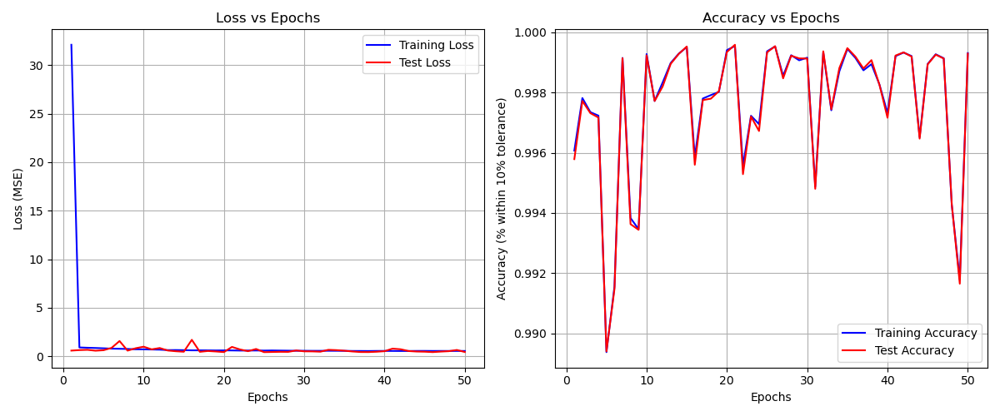

# Deep Learning Lab: PyTorch for Regression and Classification

## Overview
This lab focuses on gaining hands-on experience with the PyTorch library to perform **regression** and **multi-class classification** tasks using Deep Neural Networks (DNNs) or Multi-Layer Perceptrons (MLPs). The lab is divided into two parts: 
1. **Regression** on the NYSE dataset.
2. **Multi-class classification** on the Machine Predictive Maintenance dataset.

Below is a summary of the steps completed and the key learnings from this lab.

---

## Part 1: Regression (NYSE Dataset)

### Steps Completed:
1. **Exploratory Data Analysis (EDA):**
   - Loaded the NYSE dataset and performed initial data inspection (e.g., checking for missing values, data types, and statistical summaries).
   - Visualized data distributions, correlations, and trends using libraries like `matplotlib` and `seaborn`.
   - Identified key features for the regression task (e.g., stock prices, volumes, etc.).

2. **Deep Neural Network Architecture:**
   - Designed a DNN using PyTorch (`torch.nn`) with input, hidden, and output layers.
   - Used activation functions like ReLU for hidden layers and a linear activation for the output layer (since it's a regression task).

3. **Hyperparameter Tuning with GridSearch:**
   - Utilized `GridSearchCV` from `sklearn` to find the best hyperparameters (e.g., learning rate, optimizer, number of epochs, hidden layer sizes).
   - Tested optimizers like Adam, SGD, and RMSprop.

4. **Training and Evaluation:**
   - Trained the model on the training dataset and evaluated it on the test dataset.
   - Plotted **Loss vs. Epochs** and **Accuracy vs. Epochs** graphs for both training and test data.
   - Interpreted the graphs to check for overfitting or underfitting.
     
   
---

## Part 2: Multi-Class Classification (Machine Predictive Maintenance Dataset)

### Steps Completed:
1. **Data Preprocessing:**
   - Cleaned the dataset by handling missing values, encoding categorical variables, and removing irrelevant features.
   - Standardized/Normalized the data using `StandardScaler` or `MinMaxScaler`.

2. **Exploratory Data Analysis (EDA):**
   - Visualized class distributions, feature correlations, and outliers.
   - Identified imbalanced classes and applied data augmentation techniques (e.g., SMOTE) to balance the dataset.

3. **Deep Neural Network Architecture:**
   - Designed a DNN for multi-class classification using PyTorch.
   - Used activation functions like ReLU for hidden layers and Softmax for the output layer.

4. **Hyperparameter Tuning with GridSearch:**
   - Used `GridSearchCV` to find the best hyperparameters (e.g., learning rate, optimizer, number of epochs, hidden layer sizes).

5. **Training and Evaluation:**
   - Trained the model and plotted **Loss vs. Epochs** and **Accuracy vs. Epochs** graphs for both training and test data.
   - Interpreted the graphs to analyze model performance.

6. **Performance Metrics:**
   - Calculated metrics like **accuracy**, **precision**, **recall**, **F1-score**, and **confusion matrix** for both training and test datasets.

7. **Regularization Techniques:**
   - Applied regularization techniques like **Dropout**, **L2 regularization**, and **Data Augmentation**.
   - Compared the results with the initial model to observe improvements.

---

## Key Learnings:
1. **PyTorch Basics:**
   - Learned how to define and train DNNs using PyTorch.
   - Understood the importance of activation functions, loss functions, and optimizers.

2. **Hyperparameter Tuning:**
   - Gained experience in using `GridSearchCV` to optimize hyperparameters for better model performance.

3. **Regularization Techniques:**
   - Learned how to apply regularization techniques to prevent overfitting and improve model generalization.

4. **Data Preprocessing and EDA:**
   - Understood the importance of data cleaning, normalization, and visualization in building effective models.

5. **Model Evaluation:**
   - Learned how to evaluate models using performance metrics and interpret training/validation curves.

6. **Balancing Imbalanced Data:**
   - Applied data augmentation techniques to handle imbalanced datasets in classification tasks.

---

## Tools Used:
- **Programming Language:** Python
- **Libraries:** PyTorch, NumPy, Pandas, Matplotlib, Seaborn, Scikit-learn
- **Platforms:** Google Colab, Kaggle
- **Version Control:** GitHub

---
