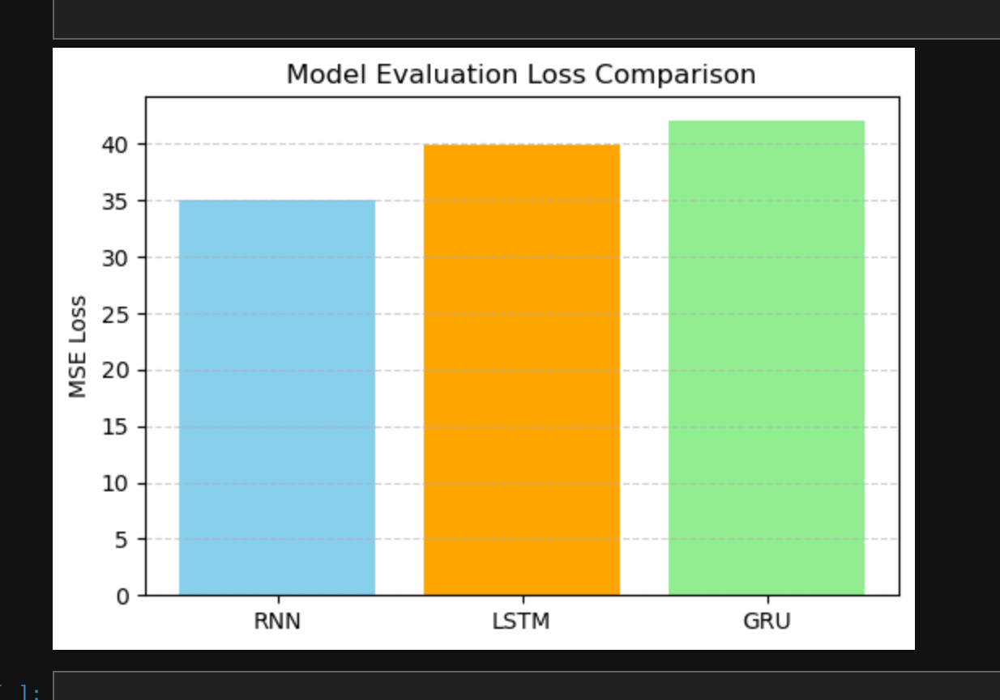

# Lab 3 - Part 1 :
# 🧪 NLP Regression with RNN/LSTM/GRU in PyTorch

This lab explores how to build Recurrent Neural Networks (RNNs), LSTMs, and GRUs using PyTorch to predict numerical labels from short text samples. The project includes:

- Web scraping data using BeautifulSoup
- Preprocessing the text and labels
- Building and training RNN-based models
- Evaluating model performance using MSE loss
- Visualizing predictions

## 📥 1. Web Scraping with BeautifulSoup

We used `requests` and `BeautifulSoup` to scrape sample text data from the web. Here's an example:

```python
import requests
from bs4 import BeautifulSoup

url = "https://example.com/sample"
response = requests.get(url)
soup = BeautifulSoup(response.content, "html.parser")

texts = [p.text.strip() for p in soup.find_all("p") if p.text.strip()]
labels = [len(text) / 100 for text in texts]  # Simulated regression target
```
## 🧹 2. Data Preprocessing
We `tokenized` the sentences, built a vocabulary, encoded the sentences as sequences of integers, and padded them to equal length.
```python
from collections import Counter
import torch
from torch.nn.utils.rnn import pad_sequence

# Tokenization
tokenized_texts = [text.lower().split() for text in texts]

# Vocabulary
word_counts = Counter(word for sentence in tokenized_texts for word in sentence)
vocab = {word: i+1 for i, (word, _) in enumerate(word_counts.items())}  # +1 for padding

# Encode & pad
encoded = [[vocab[word] for word in sentence] for sentence in tokenized_texts]
encoded_texts = pad_sequence([torch.tensor(e) for e in encoded], batch_first=True)

# Labels to tensor
labels = torch.tensor(labels, dtype=torch.float32)
```
### We then wrapped the data in a DataLoader:

```
from torch.utils.data import DataLoader, TensorDataset

dataset = TensorDataset(encoded_texts, labels)
test_loader = DataLoader(dataset, batch_size=2)
```
## 🧠 3. Model Definitions
We implemented the following models in PyTorch:

### 🔁 RNN :
```python
class RNNModel(nn.Module):
    def __init__(self, vocab_size, embedding_dim, hidden_dim):
        super(RNNModel, self).__init__()
        self.embedding = nn.Embedding(vocab_size, embedding_dim)
        self.rnn = nn.RNN(embedding_dim, hidden_dim, batch_first=True)
        self.fc = nn.Linear(hidden_dim, 1)

    def forward(self, x):
        x = self.embedding(x)
        out, _ = self.rnn(x)
        out = out[:, -1, :]
        out = self.fc(out)
        return out
```

### 🔁 LSTM :
```python
class LSTMModel(nn.Module):
    def __init__(self, vocab_size, embedding_dim, hidden_dim):
        super(LSTMModel, self).__init__()
        self.embedding = nn.Embedding(vocab_size, embedding_dim)
        self.lstm = nn.LSTM(embedding_dim, hidden_dim, batch_first=True)
        self.fc = nn.Linear(hidden_dim, 1)

    def forward(self, x):
        x = self.embedding(x)
        out, _ = self.lstm(x)
        out = out[:, -1, :]
        out = self.fc(out)
        return out
```
### 🔁 GRU :
```python
class GRUModel(nn.Module):
    def __init__(self, vocab_size, embed_dim, hidden_dim):
        super().__init__()
        self.embedding = nn.Embedding(vocab_size + 1, embed_dim)
        self.gru = nn.GRU(embed_dim, hidden_dim, batch_first=True)
        self.fc = nn.Linear(hidden_dim, 1)

    def forward(self, x):
        x = self.embedding(x)
        _, h = self.gru(x)
        return self.fc(h.squeeze(0))
```

## 📊 4. Model Training and Evaluation : 
 *Basic training loop :* 
```python
def train_model(model, train_loader, num_epochs=5, lr=0.001):
    criterion = nn.MSELoss()
    optimizer = torch.optim.Adam(model.parameters(), lr=lr)

    for epoch in range(num_epochs):
        model.train()
        total_loss = 0
        for texts, labels in train_loader:
            optimizer.zero_grad()
            output = model(texts)
            loss = criterion(output.squeeze(), labels)
            loss.backward()
            optimizer.step()
            total_loss += loss.item()

        print(f"Epoch {epoch+1}/{num_epochs}, Loss: {total_loss / len(train_loader)}")
```
For Evaluation :
```python
def evaluate_model(model, test_loader):
    model.eval()
    total_loss = 0
    with torch.no_grad():
        for texts, labels in test_loader:
            output = model(texts)
            loss = nn.MSELoss()(output.squeeze(), labels)
            total_loss += loss.item()

    print(f"Evaluation Loss: {total_loss / len(test_loader)}")
```     
## 📈 5. Visualization :
```python
# Evaluate all models
rnn_loss, rnn_preds, targets = evaluate_model(rnn_model, test_loader)
lstm_loss, lstm_preds, _ = evaluate_model(lstm_model, test_loader)
gru_loss, gru_preds, _ = evaluate_model(gru_model, test_loader)

# Bar chart
plt.bar(["RNN", "LSTM", "GRU"], [rnn_loss, lstm_loss, gru_loss])
plt.title("Model MSE Loss Comparison")
plt.ylabel("MSE Loss")
plt.show()
```



## ✅ Summary

| Step | Description |
|------|-------------|
| 1️⃣ | Scraped and cleaned web data with BeautifulSoup |
| 2️⃣ | Tokenized and padded text, built a vocabulary |
| 3️⃣ | Built RNN, LSTM, and GRU models from scratch |
| 4️⃣ | Evaluated models using MSE |
| 5️⃣ | Visualized results with Matplotlib |

## 📦 Requirements :

>`pip` install torch beautifulsoup4 matplotlib requests